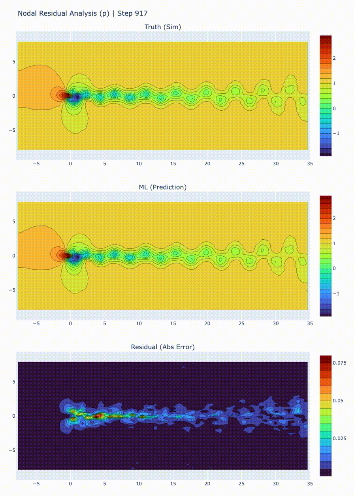

# NavierNet

A PyTorch playground to train neural nets for 2D fluid dynamics!


## Overview

NavierNet is a PyTorch-based playground for training graph neural networks (GNNs) to model 2D incompressible flow. NavierNet processes node‐wise CFD simulation data as a graph and trains a physics‐informed GNN to predict future fluid states. It accelerates CFD by learning the flow dynamics (velocity/pressure) on each mesh node from previous timesteps, enforcing incompressibility and boundary conditions in the loss.

## Quickstart

Prerequisites (macOS):
- Python ≥ 3.13
- Homebrew

Install UV (if you don't have it): see the UV docs at [UV](https://docs.astral.sh/uv/).

```bash
# clone
git clone https://github.com/<your-org-or-user>/naviernet.git
cd naviernet

# create venv + install dependencies from pyproject.toml
uv sync

# activate
source .venv/bin/activate

# install as editable package (simplifies imports)
uv pip install -e .
```


### PyFR Environment

```bash
# optional: gmsh (mesh authoring), useful but not required
brew install gmsh

# optional but helpful: libxsmm (speeds OpenMP backend if you use it)
brew install libxsmm

# required for video encoding by imageio / ffmpeg pipeline
brew install ffmpeg
```

### Run the Pipeline

The workflow is organised as three notebooks under `notebooks/`. Run them in order:

- **1) `simulation.ipynb`**: Configure parameter ranges and run PyFR cases. Writes VTU/PVD outputs to `sims/<sim_name>/pyfr_results/<case>/` and exports per‑node CSVs to `sims/<sim_name>/ml_training/`.

- **2) `training.ipynb`**: Build the graph dataset and train the GNN surrogate. Calls `build_graph` to create `sims/<sim_name>/ml_training/graph/<case>/` artefacts (`graph.npz`, `timeseries.npz`, `meta.json`), then runs `train_model` to save `model_graphsage.pt` in the same directory.

- **3) `analysis.ipynb`**: Evaluate the trained model. Loads the saved graph/model, runs teacher‑forced and bootstrapped simulations, computes residuals and generates plots/optional animations under `sims/<sim_name>/ml_training/`.

Tips:
- Best to run from the `notebooks/` directory.
- Set `SIM_NAME` (and `CASE`) consistently across notebooks before executing cells.
- Execute all cells in each notebook before proceeding to the next.

## Outputs & Artefacts

The `sims` directory stores all simulation, training  and evaluation artifacts for each experiment. Below is a sample directory structure:

```
sims/<sim_name>/
  config/                         # PyFR inputs for cases
  pyfr_results/<case>/            # VTU/PVD + PyFR outputs
  ml_training/
    case-inputs.csv               # inputs used for the case
    graph/<case>/
      graph.npz                   # graph edges + attributes (dx, dy, dist)
      timeseries.npz              # node features over time [u,v,p,x,y,flag]
      meta.json                   # metadata (normalisation, sizes, etc.)
      model_graphsage.pt          # trained model weights
    rollouts/
      <case>-teacher_forced.csv
      <case>-bootstrap.csv
    animations/                   # optional MP4s from analysis
```

## Training

The training data for this project is generated with [PyFR](https://www.pyfr.org), an open‑source computational fluid dynamics (CFD) solver. The focus is on the cylinder wake benchmark ([original paper](https://authors.library.caltech.edu/records/m8vtc-33e74?utm_source)), which captures the complex fluid flow that develops when a fluid moves past a cylinder, thus leading to boundary layer separation, vortex shedding and the formation of an unsteady wake. The cylinder wake problem is a classic but sufficiently complex problem for our models to tackle.

Simulations are conducted across a range of fluid properties and boundary conditions to create diverse scenarios. At each timestep, we extract node-level features (velocity, pressure, static geometry plus a flag for boundary nodes) on the 2D unstructured mesh. We build an undirected graph where
nodes are mesh points and edges connect adjacent nodes (with attributes dx, dy and distance).


## Architecture

The GNN is a compact two-layer GraphSAGE model (see `src/ml.py`): 
- **Input**: Node features (u, v, p, x, y, flag) at time t.
- **GraphSAGE layers**: Each layer aggregates neighbor information (mean pooling) and applies ReLU.
- **Output head**: A linear layer per node predicting deltas (du, dv, dp) for the next timestep.
- **Residual update**: Predictions are added to current state to form t+1 values.
- **Loss function**: We use mean-squared error on the deltas, plus physics‐informed regularisation terms.
For example, we penalise divergence (computed via edge dx, dy) to enforce incompressibility and add
extra weight on boundary-node errors to respect boundary conditions.

## Example Results 

The following animation demonstrates the "teacher‑forced" evaluation where the model iteratively predicts the next state of each node using ground‑truth (simulated) values as input at each step. 

After training, NavierNet can predict the next fluid state with high accuracy in a teacher-forced setup. The figure below compares model predictions to ground-truth simulation over time.



The model captures the main cylinder wake, vortex shedding and shear layers with similar amplitude. Small phase shifts or smoothing occur near high gradients and immediately behind the cylinder, but downstream errors remain localised and small.

In practice, when using *bootstrapped* predictions (that is, when the model takes its own previous predictions as input for the next timestep) errors tend to accumulate over time. This causes the model collapses toward a trivial solution and is not yet reproducing the large‑scale flow structures, suggesting the need for better normalisation/target scaling and further fine‑tuning.

For a more in-depth analysis have a peek at:
- `notebooks/training.py`
- `notebooks/analysis.py`

## Troubleshooting

Simulations in PyFR may become unstable at high Reynolds numbers. If simulations fail you might have to play around with `assets/config/2d-cylinder.ini`, the likely culprit is:
- Time step/CFL too high: Lower **dt** to 0.01 (or 0.005) and **pseudo-dt** to 0.001.
- Insufficient inner iterations: Raise pseudo-niters-min/max from 3 to 10–20 so dual-time steps converge.
- Backend/precision: Single precision on Metal can be numerically fragile. Try backend=openmp, or set [backend] precision = double (if your backend supports it).
- Order: If still unstable, test **order** = 2 to widen stability margin.

Other issues:
- If notebooks cannot find modules, ensure the venv is activated and the package was installed with `uv pip install -e .`.
- ffmpeg not found: `brew install ffmpeg`, then restart your shell.
- PyTorch device on macOS: MPS (Apple Silicon) can speed up training; see the [PyTorch MPS notes](https://pytorch.org/docs/stable/notes/mps.html).

## Next Steps

Ongoing work and future directions include:

- Model currently doesn't obey boundary conditions under bootstrapped conditions.
- Accelerate iteration speed by parallelising: (1) PyFR case sweeps across parameter grids, (2) graph building and time‑series extraction per case/timestep, and (3) training and rollout evaluation across hyperparameter sets and seeds.
- Broaden input data coverage to force generalisation: additional Reynolds numbers, timesteps and boundary conditions.
- Hyperparameter sweeps and ablations (hidden sizes, neighbours aggregation, loss weights).
- Improved physics constraints (e.g., pressure Poisson consistency, stabilisation terms).
- Cross‑case generalisation tests and zero‑shot evaluation. Run simulations on different mesh geometries.
- Performance profiling and batching for large meshes.

## Contributions

Contributions are welcome! Please:
- Open an issue to discuss substantial changes.
- Use pull requests with clear descriptions and small, focused edits.
- Follow the existing code style and keep functions/variables descriptively named.

If you have suggestions or notice any major gaps, please reach out. This project is a learning exercise and all feedback is appreciated.

## Licence

This project is licensed under the MIT License. See [LICENCE.md](LICENCE.md) for details.

<br/>

*Developed as a learning project combining CFD and graph-based machine learning.*
