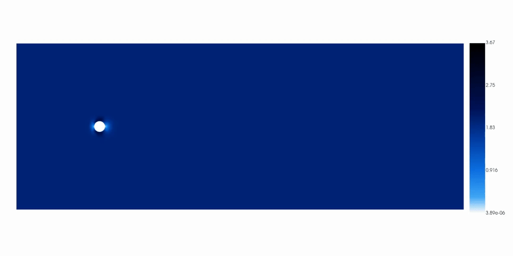

# NavierNet

A ML playground to train neural nets for 2D fluid dynamics!



## Overview

**Note:** this project is a work in progress.

The objective of this project is to provide an end-to-end pipeline for building machine learning surrogate models, trained on 2D incompressible computational fluid dynamics (CFD) simulations. Traditional CFD requires solving the high-dimensional Navier-Stokes equations, making simulations computationally demanding and slow. By leveraging graph neural networks, this project aims to accelerate CFD workflows while retaining physical fidelity...ideally!

The pipeline extracts simulation results (such as velocity and pressure at mesh nodes) and processes them into a graph format containing node features, edge relationships and time series state data. The model is then trained to predict future fluid states from current ones, while enforcing the model to obey to physical laws like incompressibity and boundry conditions. 

With the current architecture, I have been able to train the model to accurately predict the next state from the previous state with (dp, du, dv) consistently below 0.2% per step. This performance is measured in a "teacher-forced" regime, where ground-truth data is always fed in at each step and the model only predicts a single future state at a time. However, limitations to the current approach have been observed when using a bootstrapped setup — where each prediction is used as input for the next timestep - errors accumulate, eventually causing the model to become unstable due to a lack of self-correction. This suggests new approaches may need to be considered.

## Quickstart

Prerequisites (macOS):
- Python ≥ 3.13
- Homebrew
- ffmpeg (for animations)

Install UV (if you don't have it): see the UV docs at [UV](https://docs.astral.sh/uv/).

```bash
# clone
git clone https://github.com/<your-org-or-user>/naviernet.git
cd naviernet

# create venv + install dependencies from pyproject.toml
uv sync

# activate
source .venv/bin/activate

# install as editable package (simplifies imports)
uv pip install -e .
```


### PyFR Environment

```bash
# optional: gmsh (mesh authoring), useful but not required
brew install gmsh

# optional but helpful: libxsmm (speeds OpenMP backend if you use it)
brew install libxsmm

# required for video encoding by imageio / ffmpeg pipeline
brew install ffmpeg
```

### Run Pipeline

The workflow is organised as three notebooks under `notebooks/`. Run them in order:

- **1) `simulation.ipynb`**: Configure parameter ranges and run PyFR cases. Writes VTU/PVD outputs to `sims/<sim_name>/pyfr_results/<case>/` and exports per‑node CSVs to `sims/<sim_name>/ml_training/`.

- **2) `training.ipynb`**: Build the graph dataset and train the GNN surrogate. Calls `build_graph` to create `sims/<sim_name>/ml_training/graph/<case>/` artefacts (`graph.npz`, `timeseries.npz`, `meta.json`), then runs `train_model` to save `model_graphsage.pt` in the same directory.

- **3) `analysis.ipynb`**: Evaluate the trained model. Loads the saved graph/model, runs teacher‑forced and bootstrapped simulations, computes residuals and generates plots/optional animations under `sims/<sim_name>/ml_training/`.

Tips:
- Best to run from the `notebooks/` directory.
- Set `SIM_NAME` (and `CASE`) consistently across notebooks before executing cells.
- Execute all cells in each notebook before proceeding to the next.

## Outputs & Artefacts

All outputs for each run are stored within the "sims" directory. Here is a sample directory structure under `sims/<sim_name>/`:

```
sims/<sim_name>/
  config/                         # PyFR inputs for cases
  pyfr_results/<case>/            # VTU/PVD + PyFR outputs
  ml_training/
    case-inputs.csv               # inputs used for the case
    graph/<case>/
      graph.npz                   # graph edges + attributes (dx, dy, dist)
      timeseries.npz              # node features over time [u,v,p,x,y,flag]
      meta.json                   # metadata (normalisation, sizes, etc.)
      model_graphsage.pt          # trained model weights
    rollouts/
      <case>-teacher_forced.csv
      <case>-bootstrap.csv
    animations/                   # optional MP4s from analysis
```

## Training Data

The training data for this project is generated with [PyFR](https://www.pyfr.org), an open‑source computational fluid dynamics (CFD) solver. The focus is on the cylinder wake benchmark ([original paper](https://authors.library.caltech.edu/records/m8vtc-33e74?utm_source)), which captures the complex fluid flow that develops when a fluid moves past a cylinder, thus leading to boundary layer separation, vortex shedding and the formation of an unsteady wake. The cylinder wake problem is a classic but sufficiently complex problem for our models to tackle.

Simulations are conducted across a range of fluid properties and boundary conditions to create diverse scenarios. For each timestep, we extract node-level quantities (e.g., velocity, pressure) from the unstructured mesh and process the results into a dataset suitable for machine learning. The primary objective is to train a physics-informed graph-based surrogate model (wow what a mouthful) to predict the future fluid state at all mesh nodes, using the current state information of each node and its neighbours in the graph.

## Architecture

The surrogate is a compact, two-layer GraphSAGE-style GNN defined in `src/ml.py` and fed by graph artefacts produced in `src/graph_network.py`. Each mesh node becomes a "graph" node; undirected edges are extracted from the mesh defined in PyFR, with per-edge attributes (dx, dy, dist) along with flags to determine boundary nodes. At each timestep, node features concatenate the current flow state with static geometry/flags: [u, v, p, x, y, flag]. 

The model consists of two GraphSAGE layers that perform mean aggregation over neighbours, each followed by ReLU and a linear head that outputs three per-node deltas (du, dv, dp). Predictions are applied residually to form the next state, and training minimises MSE on deltas while adding physics-informed regularisation: an approximate graph divergence penalty computed from (dx, dy, dist) to encourage incompressibility, plus a boundary-weighted next-state error to respect boundary conditions.


## Troubleshooting

Simulations in PyFR may become unstable at high Reynolds numbers. Before running, verify your Reynolds number setting; a value in the range of 100–200 at dt 0.05 typically provides stable results. If simulations still fail you might have to play around with `assets/config/2d-cylinder.ini`, the likely culprate is:
- Time step/CFL too high: Lower dt to 0.01 (or 0.005) and pseudo-dt to 0.001.
- Insufficient inner iterations: Raise pseudo-niters-min/max from 3 to 10–20 so dual-time steps converge.
- Backend/precision: Single precision on Metal can be numerically fragile. Try backend=openmp, or set [backend] precision = double (if your backend supports it).
- Order: If still unstable, test order = 2 to widen stability margin.

Other issues:
- If notebooks cannot find modules, ensure the venv is activated and the package was installed with `uv pip install -e .`.
- ffmpeg not found: `brew install ffmpeg`, then restart your shell.
- PyTorch device on macOS: MPS (Apple Silicon) can speed up training; see the [PyTorch MPS notes](https://pytorch.org/docs/stable/notes/mps.html).

## Next Steps

- Model currently doesn't obey boundary conditions under bootstrapped conditions.
- Accelerate iteration speed by parallelising: (1) PyFR case sweeps across parameter grids, (2) graph building and time‑series extraction per case/timestep, and (3) training and rollout evaluation across hyperparameter sets and seeds.
- Broaden input data coverage to force generalisation: additional Reynolds numbers, timesteps and boundary conditions
- Hyperparameter sweeps and ablations (hidden sizes, neighbours aggregation, loss weights).
- Improved physics constraints (e.g., pressure Poisson consistency, stabilisation terms).
- Cross‑case generalisation tests and zero‑shot evaluation. Run simulations on different mesh geometries.
- Performance profiling and batching for large meshes.

## Contributions

Contributions are welcome! Please:
- Open an issue to discuss substantial changes.
- Use pull requests with clear descriptions and small, focused edits.
- Follow the existing code style and keep functions/variables descriptively named.

If you have suggestions or notice any major gaps, please reach out. This project is a learning exercise and all feedback is appreciated.

## MIT Licence.